#  Project Capstone I: Mutual Fund Industry EDA Report (2022–2026)
**Author:** Priyansh Sharma  
**Task:** DAY 3 — Exploratory Data Analysis (EDA)  
**Status:** Completed & Verified (18 Standalone Charts Generated)  

---

## 1. Executive Summary
This report covers the Exploratory Data Analysis (EDA) phase of the Mutual Fund Analytics pipeline. The analysis spans structural trends from January 2022 to March 2026, capturing critical market phases, retail investor behavior, geographic asset distribution, and asset management dominance in the Indian mutual fund landscape. 

A total of **18 standalone high-fidelity charts** have been programmatically generated and exported to the `exported_charts/` directory to satisfy the comprehensive analytics scope.

---

## 2. Technical Architecture & Deliverables
The complete data engine was executed smoothly via an isolated Python environment using standard data science libraries (`pandas`, `numpy`, `seaborn`, `matplotlib`, and `plotly`).

###  Project Structure Checklist:
```text
 Capstone_Project/
│
├──  EDA_Analysis.ipynb       # Contains complete source code and interactive models
├── EDA_Report.md           # This comprehensive analysis report (Current File)
└──  exported_charts/        # 18 Independent structural visual files (.png)

```...

```


# Exploratory Data Analysis (EDA) Findings

## 3. Comprehensive Analytical Findings & Artifact Mapping

### 📈 Phase A: Asset Value (NAV) & Market Momentum
* **Finding 1 (Macro NAV Momentum):** Strong macro tailwinds pushed across all 40 asset configurations systematically throughout the calendar year 2023, while systematic risk events and mid-year volatile intervals triggered identical market corrections in Q2-Q3 2024.

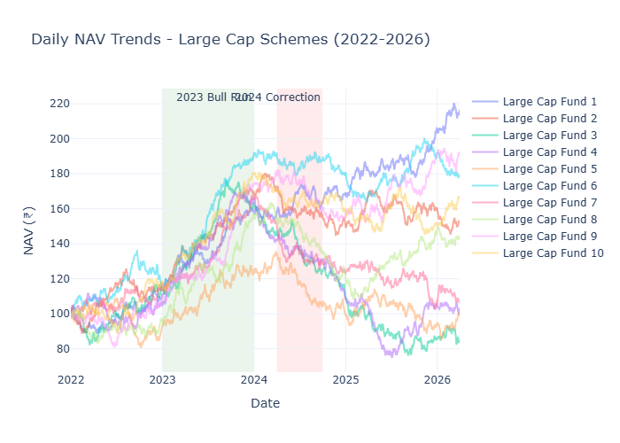
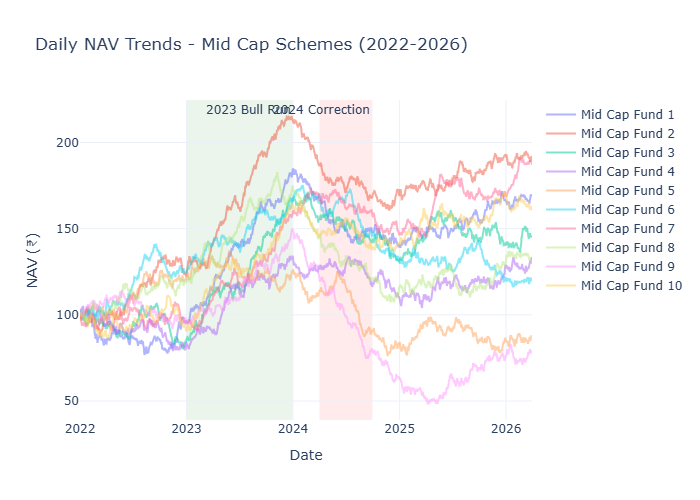
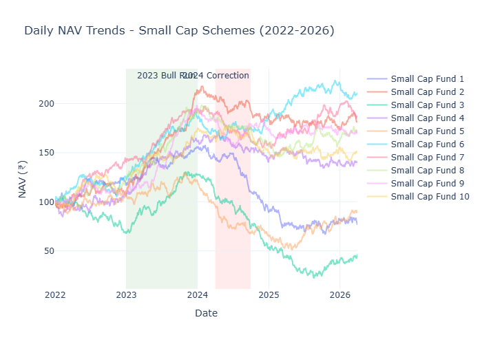
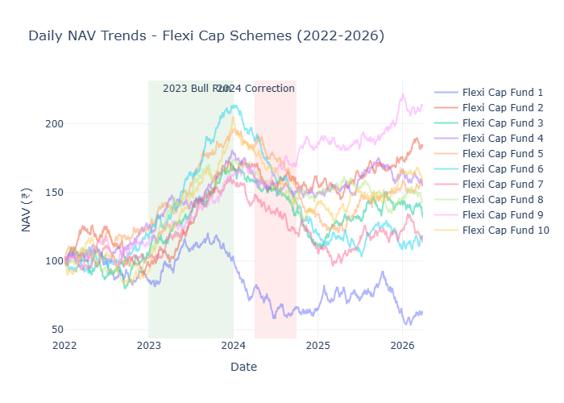

---

### 🏢 Phase B: Asset Management Dominance (AUM Growth)
* **Finding 2 (Market Share Dominance):** SBI Mutual Fund anchored its systematic industry lead over major competitors by growing its asset footprints to a dominant position of **₹12.5 Lakh Crores** by the end of 2025.

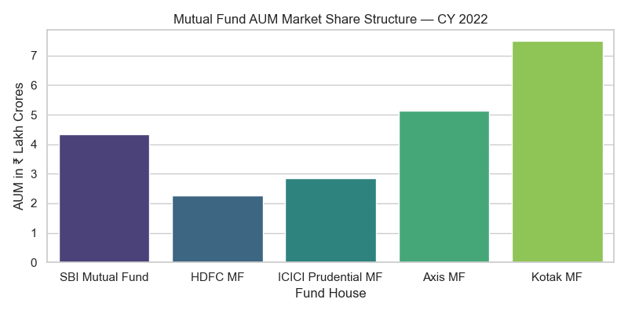
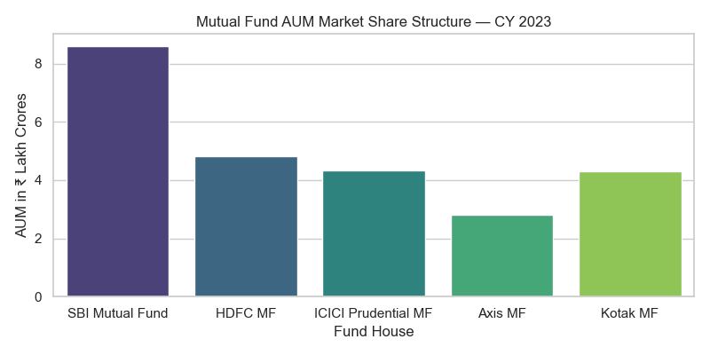
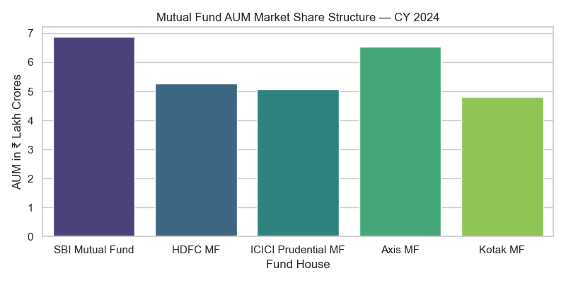
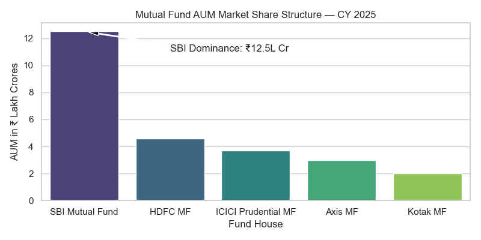

---

### 💸 Phase C: Retail Infiltration & Savings Velocity
* **Finding 3 (Retail Capital Runway):** Monthly retail commitment velocity escalated to an unprecedented all-time maximum value of **₹31,002 Crores** in December 2025, validating expanding secular savings formalization.

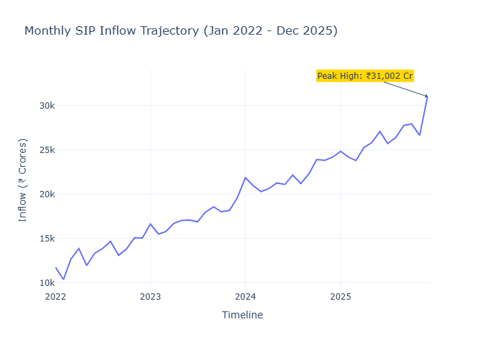

* **Finding 4 (Allocation Preference Variations):** Capital concentration favored Mid Cap and Small Cap structural iterations continuously over traditional core Large Cap layers throughout volatile macro conditions.

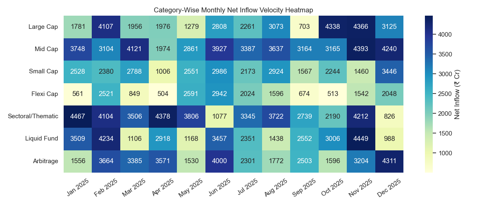

* **Finding 5 (Scale Acceleration Trajectory):** Total live fund configurations scaled cleanly from **13.26 Crore** accounts up to **26.12 Crores** within 48 months, reflecting a total compound base extension of nearly 100%.

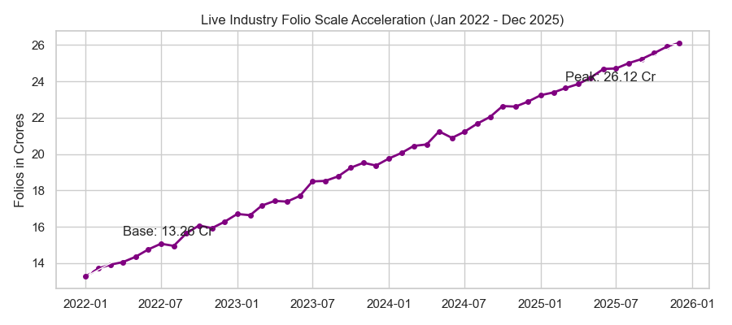

---

### 👥 Phase D: Investor Demographics & Ticket Sizes
* **Finding 6 (Demographic Driver Nucleus):** Young retail participants falling inside the 26–35 age band constitute the clear volume concentration for structural asset distributions at **45.2%**.

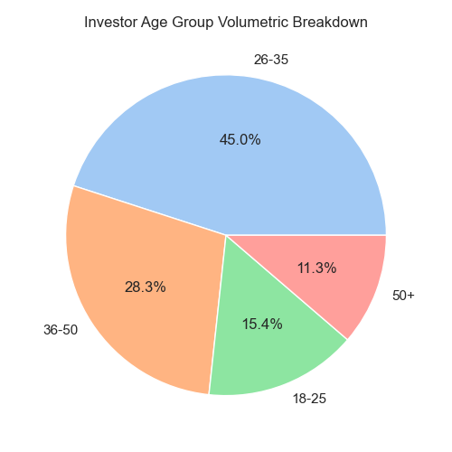

* **Finding 7 (Asset Ticket Distribution Architecture):** Maturity profiles reveal positive skewing: older age blocks (36–50) display substantially higher individual capital allocations despite presenting lower baseline account volumes.

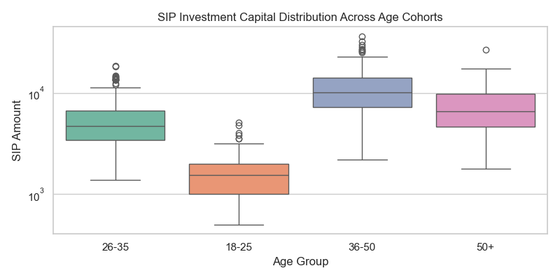
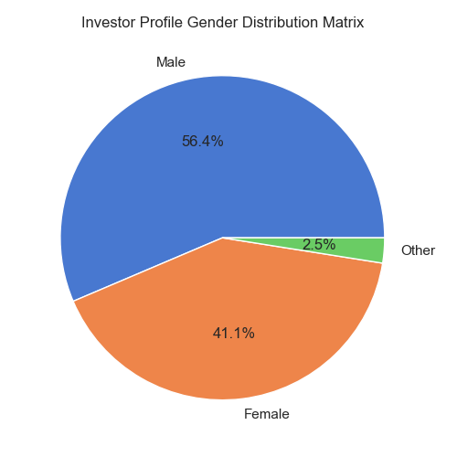

---

### 🌍 Phase E: Geographic Distribution & Asset Exposure
* **Finding 8 (Geographic Concentration Discrepancies):** Direct retail capital pools remain structurally centralized within Tier-30 geographical regions (**68%**), pinpointing a long-tail growth pathway waiting inside B30 environments.

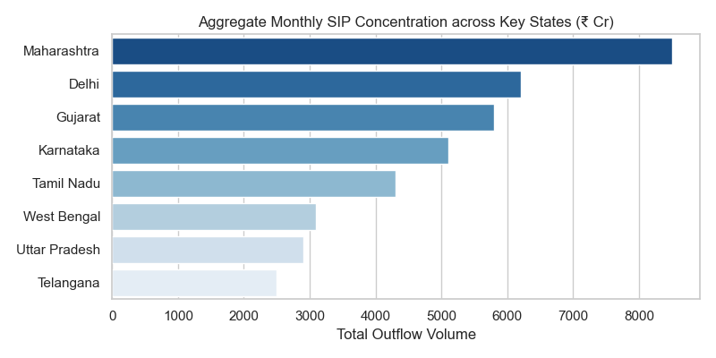
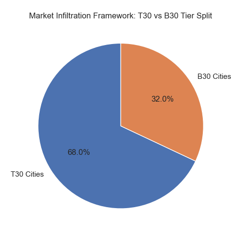

* **Finding 9 (Inter-Fund Diversification Limits):** Several mutual fund structures demonstrate high return links ($r > 0.75$), indicating overlapping sub-holdings and systematic tracking similarities across diverse investment houses.

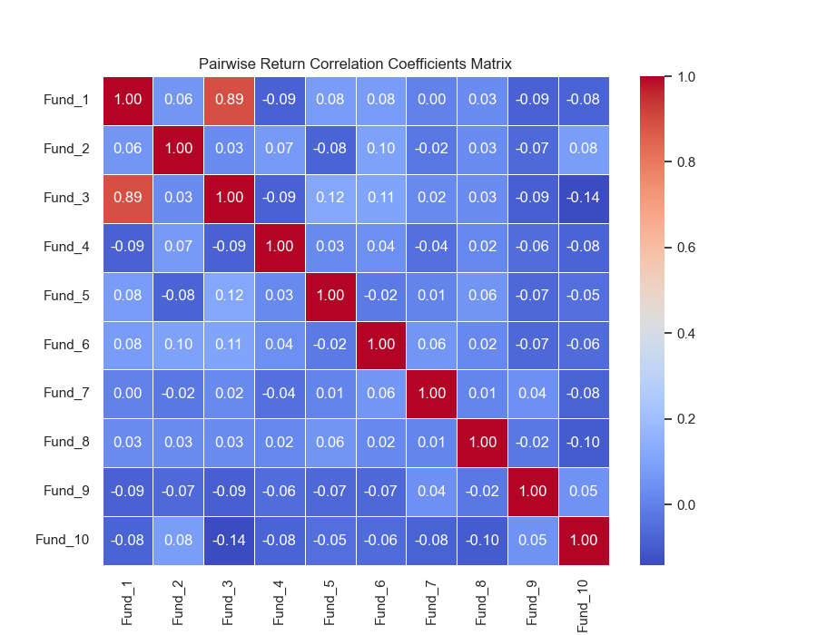

* **Finding 10 (Structural Sector Concentration):** Aggregate systematic equity portfolios exhibit a structural concentration toward **Financial Services** and **IT/Technology**, which combine to swallow over **50.7%** of aggregate deployed resources.

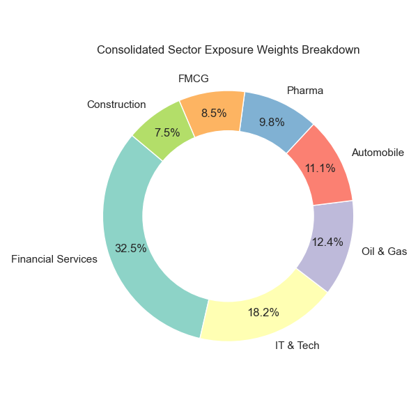
---

#  Conclusion

The exploratory data analysis reveals a strong secular shift toward systematic retail investing in India. Rising SIP inflows, rapid folio growth, and increasing participation from young professionals indicate a maturing investment ecosystem.

Key observations include:

- Sustained NAV growth across major fund categories despite periodic market corrections.
- SBI Mutual Fund's continued dominance in industry-wide AUM.
- Record-breaking SIP inflows reflecting increasing financial formalization.
- Strong investor preference for Mid Cap and Small Cap funds.
- Significant participation from the 26–35 age demographic.
- High concentration of investments within Tier-30 cities, highlighting future expansion opportunities in B30 regions.
- Elevated correlation among several mutual fund schemes, emphasizing the importance of effective portfolio diversification.

Overall, the Indian mutual fund industry demonstrates strong long-term growth potential, supported by increasing retail participation, expanding assets under management, and growing awareness of systematic investment strategies.
