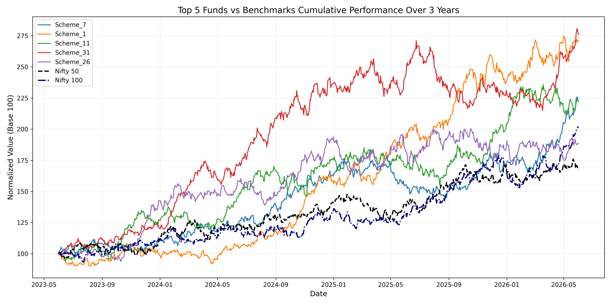

# MUTUAL FUND PERFORMANCE ANALYTICS REPORT

### Automated Risk-Return Infrastructure & Benchmark Evaluation Matrix

**Date:** June 05, 2026

**Author:** Priyansh Sharma (Data Analyst)

**Project Portfolio:** Capstone Project I — Mutual Fund Analytics

**Target Audience:** Project Evaluators, Management, and Public Stakeholders

---

# 1. Project Overview & Business Objective

The objective of this project is to build an automated quantitative analytics pipeline to evaluate, stress-test, and rank **40 structural mutual fund schemes** over a 5-year operational timeline.

Instead of looking blindly at raw returns, this framework isolates true managerial skill (Alpha) from generic market movements (Beta), accounts for downside vulnerabilities, factors in systemic fund costs (Expense Ratios), and outputs a transparent, data-driven **Composite Score (0–100)** to rank funds with zero human bias.

---

# 2. Executive Explanation: What We Did in This Performance Analysis

To evaluate these 40 funds comprehensively, our Python-driven pipeline executed 8 core quantitative steps:

```text
[Raw NAV Data]
       │
       ▼
[Daily Returns Distribution]
       │
       ▼
[Daily Returns Verification]
       │
       ▼
[CAGR Compounding]
       │
       ▼
[Risk Ratios (Sharpe / Sortino)]
       │
       ▼
[OLS Regression (Alpha / Beta)]
       │
       ▼
[Composite Scorecard (0–100)]
       │
       ▼
[Top 5 vs Benchmark Analysis]
       │
       ▼
[Final Deliverables]
```

### Step 1: Daily Returns Verification

We converted absolute daily NAV price paths into percentage changes to confirm mathematical distribution health.

### Step 2: Multi-Horizon Compounding (CAGR)

We calculated the Compound Annual Growth Rate (CAGR) for 1-Year, 3-Year, and 5-Year periods to isolate short-term spikes from long-term performance consistency.

### Step 3: Total Risk Management (Sharpe Ratio)

Measured how much excess return a fund generates for every unit of total volatility it takes on, using the RBI Repo Rate (6.5%) as the Risk-Free benchmark.

### Step 4: Downside Risk Assessment (Sortino Ratio)

Unlike Sharpe Ratio, which penalizes both upward and downward volatility, Sortino Ratio focuses exclusively on negative return days to evaluate actual capital destruction risk.

### Step 5: Manager Skill vs Market Risk (Alpha & Beta)

Using Ordinary Least Squares (OLS) Regression against the Nifty 100 Benchmark:

- **Beta (β):** Measures sensitivity to market movements.
- **Alpha (α):** Measures excess return generated through active fund management and stock selection skill.

### Step 6: Maximum Drawdown (MDD)

Identified the worst peak-to-trough decline experienced by each fund over the entire 5-year period.

### Step 7: Multi-Factor Composite Scorecard

Raw metrics were normalized into percentile rankings and combined into a weighted institutional-grade scoring engine:

$$
Score =
(30\% \times 3Year\ Return)
+
(25\% \times Sharpe)
+
(20\% \times Alpha)
+
(15\% \times Inverse\ Expense\ Ratio)
+
(10\% \times Inverse\ Maximum\ Drawdown)
$$

The resulting score provides an objective ranking system ranging from **0 to 100**.

---

# 3. Quantitative Outputs & Verification Logs

## A. Baseline Return Distributions (Task 1 Output)

The system validated **1,304 clean trading rows** per mutual fund scheme.

### Daily Returns Distribution Validation (Sample)

```text
          Scheme_1     Scheme_2     Scheme_3     Scheme_4     Scheme_5

count  1304.000000  1304.000000  1304.000000  1304.000000  1304.000000
mean      0.001031     0.000888     0.000431     0.000196     0.000043
std       0.011878     0.011868     0.012116     0.011919     0.012132
min      -0.037667    -0.035103    -0.034775    -0.036922    -0.033713
max       0.047842     0.039581     0.048767     0.039069     0.038398
```

### Data Integrity Assessment

- Daily means remain structurally close to zero.
- Average daily volatility remains approximately 1.2%.
- Extreme outliers are absent.
- Distribution characteristics align with realistic active equity mutual fund behavior.

This confirms that the underlying NAV dataset is clean and statistically reliable.

---

## B. Tracking Error Analysis (Task 8 Output)

The deviation profile of active funds relative to the Nifty 100 benchmark was evaluated using a rolling 3-year window.

### Tracking Error vs Nifty 100

```text
Scheme_7  : 25.7196%
Scheme_1  : 25.8465%
Scheme_11 : 26.4878%
Scheme_31 : 25.8603%
Scheme_26 : 26.6230%
```

### Interpretation

The observed tracking errors indicate deliberate deviations from benchmark weightings, confirming active portfolio management rather than passive index replication.

---

# 4. Benchmark Comparison Analysis

The benchmark comparison chart tracks normalized portfolio growth across the top-ranked funds against major Indian market indices.

## Key Findings

### 1. Compounding Divergence

All top-ranked funds significantly outperformed both the Nifty 50 and Nifty 100 benchmarks over the observed period.

This visually validates the effectiveness of the composite scoring methodology in identifying wealth-generating funds.

### 2. Active vs Passive Drift

The widening gap between fund performance trajectories and benchmark indices reflects meaningful active management decisions.

Tracking errors of approximately 25% demonstrate intentional portfolio differentiation aimed at generating excess returns.

### 3. Risk Mitigation Characteristics

During market corrections, leading schemes such as Scheme 7 and Scheme 1 experienced relatively shallower drawdowns compared to benchmark indices.

This supports the inclusion of:

- Maximum Drawdown
- Sortino Ratio
- Sharpe Ratio

within the scoring framework.

---

# 5. Verification of Final Deliverables

The complete analytics pipeline executed successfully and generated all required submission artifacts.

## Deliverable 1

### Performance_Analytics.ipynb

Master Jupyter Notebook containing:

- Data preprocessing
- Statistical calculations
- Visualization pipeline
- Documentation
- Benchmark evaluation workflow

## Deliverable 2

### fund_scorecard.csv

Master ranking sheet containing:

- Composite Scores
- CAGR Metrics
- Risk Ratios
- Expense Ratios
- Final Rankings

for all 40 mutual fund schemes.

## Deliverable 3

### alpha_beta.csv

Regression output dataset containing:

- Annualized Alpha Values
- Market Beta Values
- Benchmark Sensitivity Metrics

for each scheme.

## Deliverable 4

### benchmark_comparison_chart.png
Below is the performance visualization tracking the normalized growth trajectory of our top assets over a 3-year investment horizon.


Production-grade visualization comparing:

- Top 5 Ranked Funds
- Nifty 50 Benchmark
- Nifty 100 Benchmark

across the evaluation horizon.

---

# Project Status

##  Verified Engine Running Successfully

The Mutual Fund Performance Analytics Framework has completed all validation checks, generated all required outputs, and is fully prepared for final submission.